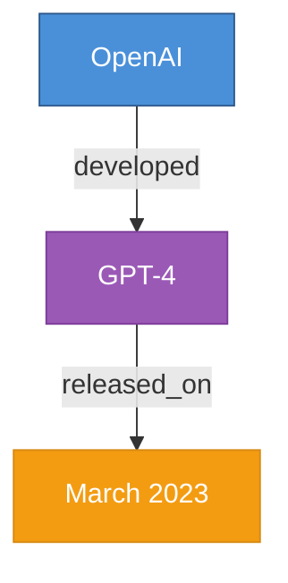

# Knowledge Graph Generator

Generate visual knowledge graphs from articles or books using **chapter-by-chapter processing**.

## Model Responsibilities

| Task | Model | Output |
|------|-------|--------|
| Content analysis & chunking | Default | Chapter list |
| JSON triple extraction | Default | JSON file |
| Mermaid.js code generation | Default | .mmd file |
| Image prompt generation | Default | Text prompts |
| **Knowledge graph image generation** | **User specified (default: nano banana)** | **PNG/JPG images** |

## Image Model Selection

Users can specify which image generation model to use:

| Model | Identifier | Notes |
|-------|------------|-------|
| **nano banana** | `nano banana` / `nanobanana` | **Default, Recommended** - Best for knowledge graph diagrams |
| DALL-E | `dalle` / `dall-e` | OpenAI's image model |
| Midjourney | `midjourney` / `mj` | Via API or bot |
| Stable Diffusion | `sd` / `stable-diffusion` | Local or API |
| Ideogram | `ideogram` | Good for text in images |
| Other | Custom identifier | Any available image model |

**Usage examples:**
```
/knowledge-graph path/to/article.md
→ Uses nano banana (default)

/knowledge-graph 请使用dalle为这篇文章生成知识图
→ Uses DALL-E

/knowledge-graph --image-model midjourney document.md
→ Uses Midjourney

用ideogram生成知识图谱 [附件]
→ Uses Ideogram
```

**Detecting user's model preference:**
- Explicit parameter: `--image-model <model>`
- Natural language: "使用dalle"、"use midjourney"、"用stable diffusion"
- If not specified: default to **nano banana**

## Parallel vs Sequential Processing

Image generation can run in **parallel** or **sequential** mode depending on agent capabilities.

| Mode | Requirement | Speed | Use When |
|------|-------------|-------|----------|
| **Parallel** | Agent supports concurrent subtasks | ~N× faster | Multiple chapters, no rate limits |
| **Sequential** | Any agent | Baseline | Rate-limited APIs, debugging |

### Parallel Mode (Recommended when supported)

If the agent platform supports parallel subtask execution, generate all chapter images concurrently:

```
┌─────────────────────────────────────────────────────────────┐
│  PARALLEL PROCESSING                                        │
│                                                             │
│  ┌─ Chapter 1 prompt → [image model] ─┐                    │
│  ├─ Chapter 2 prompt → [image model] ─┼─→ All complete     │
│  ├─ Chapter 3 prompt → [image model] ─┤    simultaneously  │
│  └─ Chapter N prompt → [image model] ─┘                    │
│                                                             │
│  Time: ~1 image generation cycle (vs N cycles sequential)  │
└─────────────────────────────────────────────────────────────┘
```

### Sequential Mode (Fallback)

If parallel not supported, process one chapter at a time:

```
┌─────────────────────────────────────────────────────────────┐
│  SEQUENTIAL PROCESSING                                      │
│                                                             │
│  Chapter 1 → wait → Chapter 2 → wait → Chapter 3 → ...     │
│                                                             │
│  Time: N × single image generation cycle                   │
└─────────────────────────────────────────────────────────────┘
```

### Detecting Processing Mode

**Auto-detect** (recommended):
1. Check if agent platform supports parallel task spawning
2. If yes → use parallel mode
3. If no → fallback to sequential mode

**User override:**
- `--parallel` or `并行生成` → Force parallel mode
- `--sequential` or `顺序生成` → Force sequential mode

**Examples:**
```bash
# Auto-detect (default)
/knowledge-graph path/to/book.md

# Force parallel
/knowledge-graph path/to/book.md --parallel
/knowledge-graph 并行生成这本书的知识图谱

# Force sequential (for rate-limited APIs)
/knowledge-graph path/to/book.md --sequential
```

## Workflow Overview

```
┌─────────────────────────────────────────────────────────────┐
│  Step 0: Detect Preferences                                 │
│  - Image model: nano banana (default) / dalle / mj / ...    │
│  - Processing mode: parallel (if supported) / sequential    │
└─────────────────────────────────────────────────────────────┘
                              │
                              ▼
┌─────────────────────────────────────────────────────────────┐
│  Step 1: Analyze & Split Document [DEFAULT MODEL]           │
└─────────────────────────────────────────────────────────────┘
                              │
                              ▼
┌─────────────────────────────────────────────────────────────┐
│  Step 2: For Each Chapter [DEFAULT MODEL]                   │
│  - Extract JSON triples                                     │
│  - Generate Mermaid.js code                                 │
│  - Generate image prompt (tailored to selected model)       │
└─────────────────────────────────────────────────────────────┘
                              │
                              ▼
               ┌──────────────┴──────────────┐
               │   Agent supports parallel?   │
               └──────────────┬──────────────┘
                      ┌───────┴───────┐
                      ▼               ▼
┌─────────────────────────┐ ┌─────────────────────────┐
│  Step 3a: PARALLEL      │ │  Step 3b: SEQUENTIAL    │
│                         │ │                         │
│  All chapters           │ │  Chapter 1 → wait       │
│  simultaneously:        │ │  Chapter 2 → wait       │
│  [Ch1, Ch2, Ch3, ...]   │ │  Chapter 3 → wait       │
│  → [image model]        │ │  ...                    │
│  → All images at once   │ │  → One by one           │
└─────────────────────────┘ └─────────────────────────┘
                      └───────┬───────┘
                              ▼
┌─────────────────────────────────────────────────────────────┐
│  Step 4: Output Summary [DEFAULT MODEL]                     │
└─────────────────────────────────────────────────────────────┘
```

## Detailed Workflow

### Step 1: Analyze Document Structure [DEFAULT MODEL]

Parse the document to identify chapter/section boundaries:
- H1/H2/H3 headers
- Numbered sections
- Explicit chapter markers

Split into chunks of **500-1000 tokens** each.

### Step 2: Process Each Chapter [DEFAULT MODEL]

For each chapter, generate three outputs:

#### 2.1 JSON Triples

Extract entity-relationship triples:

```json
[
  {"head": "OpenAI", "head_type": "Organization", "relation": "developed", "tail": "GPT-4", "tail_type": "Technology"},
  {"head": "GPT-4", "head_type": "Technology", "relation": "released_on", "tail": "March 2023", "tail_type": "Date"}
]
```

#### 2.2 Mermaid.js Code

Generate visualization code:



#### 2.3 Image Prompt for Nano Banana

Generate a structured prompt for knowledge graph image generation. See `references/nano-banana-prompts.md` for prompt templates.

### Step 3: Generate Images [SELECTED IMAGE MODEL]

Route image generation to the user-specified model (default: nano banana).

**Choose processing mode based on agent capabilities:**

#### 3a. Parallel Mode (if agent supports concurrent subtasks)

```
┌─────────────────────────────────────────────────────────────┐
│  PARALLEL PROCESSING - ALL AT ONCE                          │
│                                                             │
│  Spawn concurrent tasks:                                    │
│  ┌─ Task 1: Chapter 1 prompt → [image model] ─┐            │
│  ├─ Task 2: Chapter 2 prompt → [image model] ─┤            │
│  ├─ Task 3: Chapter 3 prompt → [image model] ─┼─→ Collect  │
│  └─ Task N: Chapter N prompt → [image model] ─┘   all      │
│                                                             │
│  Wait for ALL tasks to complete, then save all images      │
└─────────────────────────────────────────────────────────────┘
```

**Benefits of parallel:**
- ~N× faster for N chapters
- Better utilization of image generation resources
- Same quality results

**Implementation hint:**
```python
# Pseudocode for parallel execution
tasks = []
for chapter in chapters:
    task = spawn_image_task(chapter.prompt, image_model)
    tasks.append(task)

# Wait for all to complete
results = await gather_all(tasks)

# Save all images
for chapter, image in zip(chapters, results):
    save_image(image, chapter.output_path)
```

#### 3b. Sequential Mode (fallback if parallel not supported)

```
┌─────────────────────────────────────────────────────────────┐
│  SEQUENTIAL PROCESSING - ONE BY ONE                         │
│                                                             │
│  Chapter 1 prompt → [image model] → wait → save image       │
│  Chapter 2 prompt → [image model] → wait → save image       │
│  Chapter 3 prompt → [image model] → wait → save image       │
│  ...                                                        │
└─────────────────────────────────────────────────────────────┘
```

**When to use sequential:**
- Agent doesn't support parallel subtasks
- Image API has strict rate limits
- Debugging or testing
- User explicitly requests `--sequential`

### Step 4: Save Outputs [DEFAULT MODEL]

```
output/
├── chapter-1/
│   ├── triples.json          # JSON 三元组数据
│   ├── graph.mmd             # Mermaid.js 代码
│   ├── image-prompt.txt      # 发送给图像模型的 prompt
│   └── knowledge-graph.png   # 生成的知识图谱图片
├── chapter-2/
│   ├── triples.json
│   ├── graph.mmd
│   ├── image-prompt.txt
│   └── knowledge-graph.png
├── ...
├── merged-triples.json       # 所有章节合并的三元组
└── full-graph.mmd            # 完整的 Mermaid 图（所有章节）
```

**输出文件说明：**

| 文件 | 生成者 | 用途 |
|------|--------|------|
| `triples.json` | 默认模型 | 结构化知识数据，可导入 Neo4j/NetworkX |
| `graph.mmd` | 默认模型 | Mermaid 可视化代码，可在 mermaid.live 预览 |
| `image-prompt.txt` | 默认模型 | 图像生成 prompt，便于调试和复用 |
| `knowledge-graph.png` | 图像模型 | 最终的知识图谱可视化图片 |
| `merged-triples.json` | 默认模型 | 全文档合并去重后的三元组 |
| `full-graph.mmd` | 默认模型 | 全文档的 Mermaid 代码 |

## Schema Definition

Before extraction, define allowed entity and relationship types:

### Entity Types

```yaml
entity_types:
  - Person
  - Organization
  - Technology
  - Location
  - Date
  - Concept
  - Event
  - Product
```

### Relationship Types

```yaml
relationships:
  - founded_by
  - works_for
  - located_in
  - developed
  - released_on
  - part_of
  - acquired
  - competitor_of
  - caused
  - depends_on
```

## References

| Reference | Contents |
|-----------|----------|
| `references/nano-banana-prompts.md` | Image generation prompts for nano banana model |
| `references/extraction-workflow.md` | Chunking, JSON extraction, and merging strategies |
| `references/layouts/*.md` | Visual layout templates (hierarchical, radial, force, tree) |

## Usage Examples

```bash
# Basic usage (nano banana + auto-detect parallel/sequential)
/knowledge-graph path/to/document.md

# Specify image model
/knowledge-graph path/to/article.md --image-model dalle
/knowledge-graph path/to/book.md --image-model midjourney

# Natural language with model specification
/knowledge-graph 请使用dalle为这篇文章生成知识图
/knowledge-graph use stable diffusion to create knowledge graph for this document

# Force parallel processing (faster, if agent supports it)
/knowledge-graph path/to/book.md --parallel
/knowledge-graph 并行生成这本书的知识图谱

# Force sequential processing (for rate-limited APIs)
/knowledge-graph path/to/book.md --sequential
/knowledge-graph 顺序生成知识图

# Specific chapter only
/knowledge-graph path/to/book.md --chapter 3

# Custom schema
/knowledge-graph path/to/article.md --entities "Technology,Framework,API"

# Combine options
/knowledge-graph path/to/book.md --image-model ideogram --parallel --chapter 2
```

## Key Principles

1. **Chapter-by-chapter**: Never process entire document at once
2. **Default model first**: JSON, Mermaid, and prompts all generated by default model
3. **Parallel when possible**: Use parallel image generation if agent supports concurrent subtasks
4. **Sequential as fallback**: Fall back to sequential if parallel not supported or rate-limited
5. **Schema-constrained extraction**: Define entity/relationship types before extraction
6. **Atomic entities**: "Apple" not "Apple Inc. based in California"
7. **Respect user preferences**: Honor specified image model and processing mode

## Notes

- Default model handles all text generation (JSON, Mermaid, prompts)
- Image model (nano banana by default, or user-specified) handles only image generation
- **Parallel mode**: Recommended for speed when agent supports concurrent subtasks
- **Sequential mode**: Use for rate-limited APIs or when parallel not supported
- Save all outputs (JSON, Mermaid, images) for each chapter
- Large documents: show progress per chapter
- **nano banana is recommended** for best knowledge graph visualization quality
