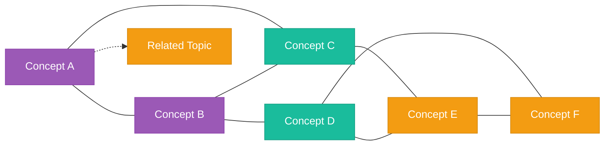
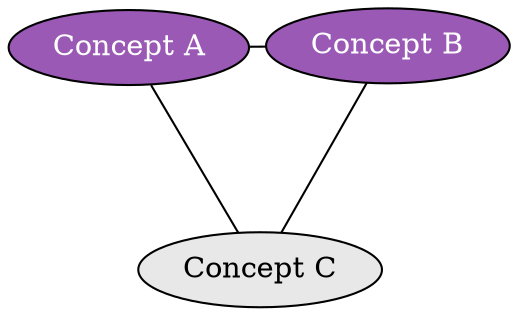

# force

Physics-based clustering where related concepts group naturally.

## Graph Direction

- No fixed direction
- Nodes cluster by relationship density
- Organic, network-like appearance

## Visual Characteristics

- Highly connected nodes pull together
- Loosely connected nodes drift apart
- Natural groupings emerge
- Shows interconnection complexity

## Mermaid Template

## DOT Template (Better for Force Layout)

## Node Limits

- Max nodes: 30-40 for readability
- Connections should be meaningful, not exhaustive
- Group dense clusters with visual styling

## Best For

- Complex systems with many interdependencies
- Research papers with cross-references
- Technical architectures
- Social network analysis
- Ecosystem or market analysis
