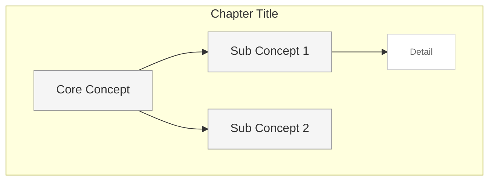

# hierarchical

Top-down tree structure with clear parent-child relationships.

## Graph Direction

- Primary: Top to Bottom (TB)
- Alternative: Left to Right (LR) for wide content

## Visual Characteristics

- Root node at top, children below
- Levels aligned horizontally
- Clear vertical flow of information
- Subgraphs for chapter grouping

## Mermaid Template

## Node Limits

- Max depth: 4 levels
- Max nodes per level: 6
- Max total nodes per chapter: 20

## Best For

- Textbooks with clear chapter structure
- Tutorial content with prerequisites
- API documentation
- Organizational hierarchies
- Taxonomies and classifications
