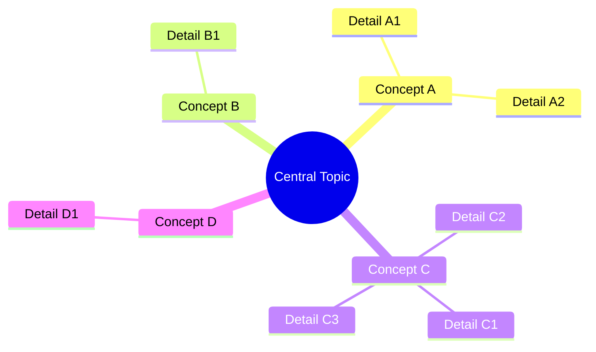
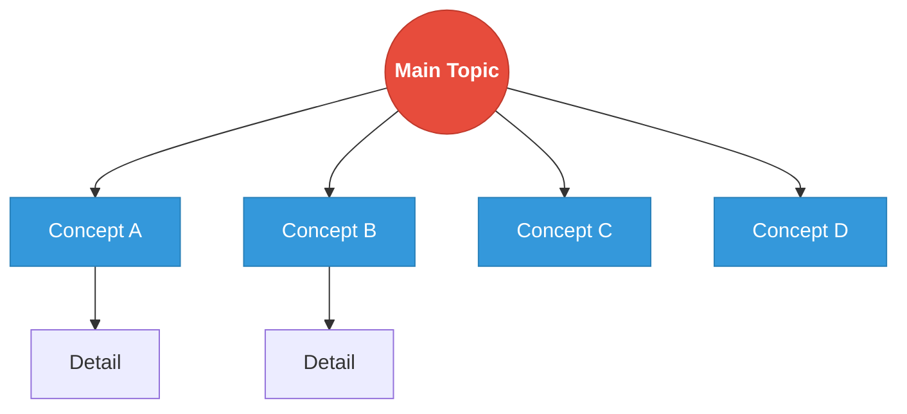

# radial

Central concept with radiating branches in all directions.

## Graph Direction

- Center-out expansion
- Use mindmap or flowchart with careful positioning

## Visual Characteristics

- Central node is the main topic
- First-level concepts radiate outward
- Details branch from concepts
- Emphasizes the core idea

## Mermaid Template

## Alternative Flowchart Style

## Node Limits

- Max first-level branches: 8
- Max second-level per branch: 5
- Max depth: 3 levels

## Best For

- Single-topic deep exploration
- Brainstorming summaries
- Concept maps around a theme
- Problem-solution analysis
- Feature overview of a product
