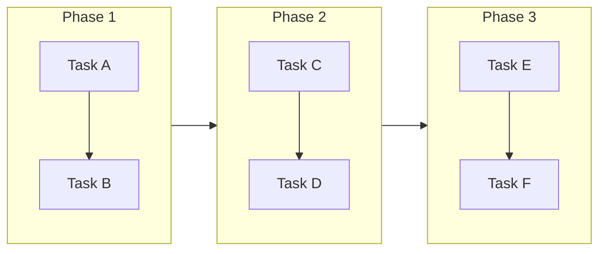

# tree

Left-to-right branching structure for sequential content.

## Graph Direction

- Primary: Left to Right (LR)
- Shows progression and flow

## Visual Characteristics

- Start point on left, end on right
- Sequential steps connected horizontally
- Branches for alternatives or sub-processes
- Timeline-like appearance

## Mermaid Template

```mermaid
graph LR
    classDef start fill:#27AE60,stroke:#1E8449,color:#fff
    classDef process fill:#3498DB,stroke:#2980B9,color:#fff
    classDef decision fill:#F39C12,stroke:#D68910,color:#fff
    classDef end fill:#E74C3C,stroke:#C0392B,color:#fff

    A[Start]:::start --> B[Step 1]:::process
    B --> C{Decision}:::decision
    C -->|Yes| D[Step 2A]:::process
    C -->|No| E[Step 2B]:::process
    D --> F[Step 3]:::process
    E --> F
    F --> G[End]:::end
```

## Timeline Variant



## Node Limits

- Max steps in main path: 10
- Max branches per decision: 3
- Max parallel paths: 4

## Best For

- Process documentation
- Workflow guides
- Historical timelines
- Decision trees
- User journey maps
- Tutorial step sequences
